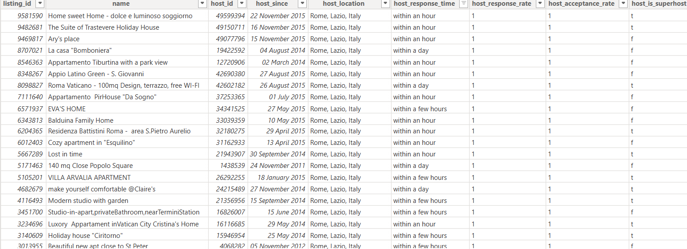
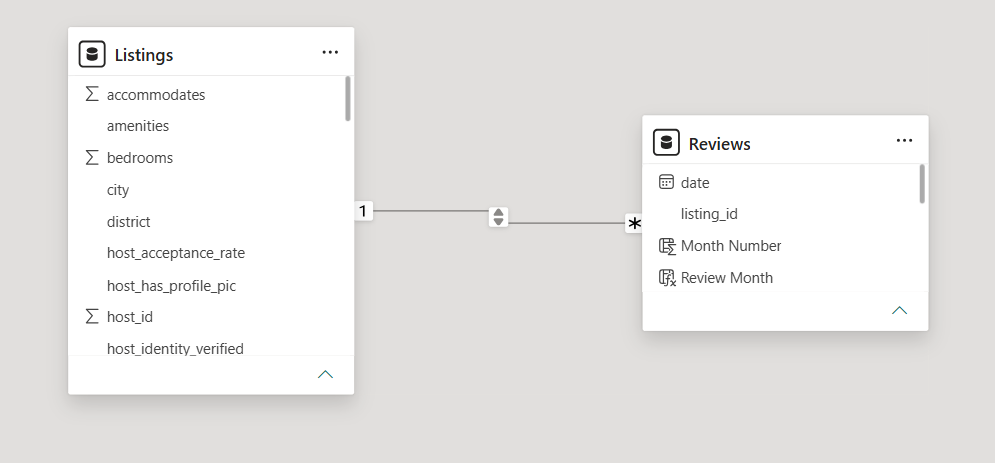
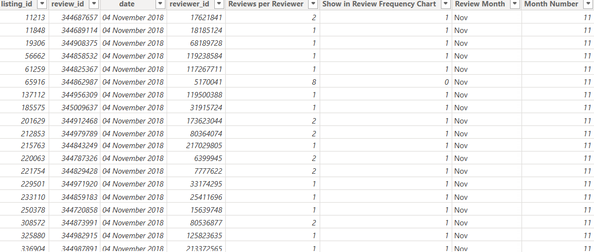
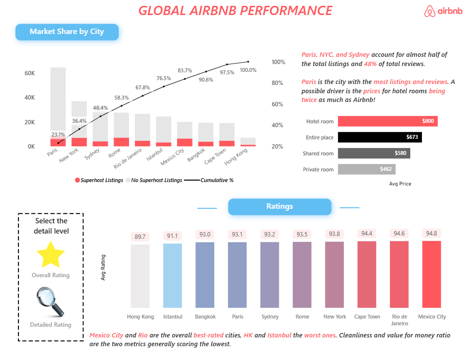
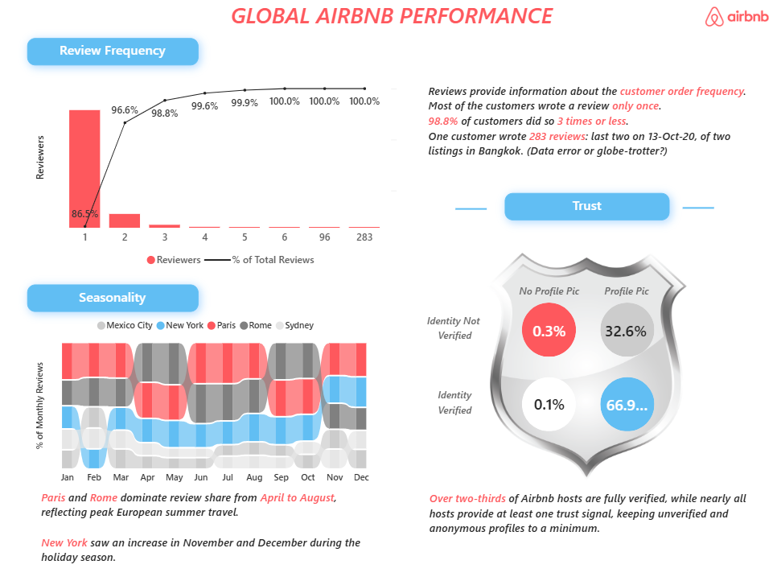

# 🏠 Airbnb Global Performance Analysis


 


------------------------------------------------------------------------

## Overview

This project presents an interactive **Airbnb Global Performance
Dashboard** developed in Power BI to analyze listing performance, host
characteristics, customer ratings, and review behaviour across major
Airbnb markets.

The analysis combines **data preparation, relational data modeling,
calculated columns, DAX measures, ranking logic, cumulative analysis,
segmentation, and interactive visualization** to transform large-scale
Airbnb listing and review data into meaningful business insights.

The project follows a Power BI-focused analytics workflow:

**Raw Data → Data Preparation → Data Modeling → DAX & Calculations →
Interactive Dashboard → Business Insights**

The dashboard analyzes **279K+ listings, 182K+ hosts, 144 property
types, 10 cities, and 5.3M+ reviews**.

------------------------------------------------------------------------

## 🎯 Business Objective

The objective of this analysis is to understand Airbnb's marketplace
performance from multiple perspectives and identify patterns in
listings, hosts, ratings, and customer engagement.

The key business questions explored include:

-   How has Airbnb's listing volume evolved over time?
-   Which cities contribute the largest share of Airbnb listings?
-   How are listings distributed across different room and property
    types?
-   Which cities achieve the strongest and weakest guest ratings?
-   Which rating dimensions require greater attention?
-   How do host verification and profile presence contribute to host
    trust?
-   How frequently do customers leave reviews?
-   How concentrated is reviewer activity among highly active customers?
-   How does review activity vary across different months and seasons?

------------------------------------------------------------------------

## 🔄 Project Workflow

``` text
                         Raw Airbnb Data
                                │
                                ▼
                       Data Preparation
                                │
                                ▼
                        Data Modeling
                    ┌────────────────────┐
                    │      Listings      │
                    │      Reviews       │
                    └─────────┬──────────┘
                              │
                              ▼
                       Calculated Fields
                              │
                              ▼
                         DAX Measures
                              │
                ┌─────────────┴─────────────┐
                │                           │
                ▼                           ▼
        Performance Analysis         Customer Analysis
                │                           │
                └─────────────┬─────────────┘
                              │
                              ▼
                         Power BI
                    Interactive Dashboard
                              │
                              ▼
                       Business Insights
```

------------------------------------------------------------------------

# 📂 Dataset

The project uses the **Airbnb Listings & Reviews** dataset provided
through the Maven Analytics Data Playground.

The dataset contains listing-level, host-level and review-level
information that enables analysis of Airbnb marketplace performance and
customer behaviour.

### Dataset Highlights

-   **279K+ listings**
-   **182K+ hosts**
-   **144 property types**
-   **10 cities**
-   **5.3M+ reviews**

### Main Data Areas

  -----------------------------------------------------------------------
  Area                                Examples
  ----------------------------------- -----------------------------------
  Listings                            `listing_id`, `property_type`,
                                      `room_type`, `price`

  Hosts                               `host_id`, `host_since`,
                                      `host_is_superhost`

  Location                            `city`, `district`, `latitude`,
                                      `longitude`

  Reviews                             `review_id`, `reviewer_id`, `date`

  Ratings                             Accuracy, Cleanliness,
                                      Communication, Location, Rating,
                                      Value

  Booking                             Accommodates, Minimum Nights,
                                      Maximum Nights

  Host Trust                          Identity Verification, Profile
                                      Picture
  -----------------------------------------------------------------------

## Dataset Source

**Dataset Provider:** Maven Analytics Data Playground\
**Original Source:** Inside Airbnb\
**License:** Public Domain

🔗 [View Original
Dataset](https://mavenanalytics.io/data-playground/airbnb-listings-reviews)

> The complete datasets are hosted externally due to their large file
> sizes.

------------------------------------------------------------------------

## Dataset Preview



------------------------------------------------------------------------

# 🧩 Data Model

The Power BI model connects the **Listings** and **Reviews** datasets
through `listing_id`.

This relational structure allows listing-level attributes to be analyzed
alongside review-level activity.

The model was designed to support both marketplace-level analysis and
detailed customer review analysis.



------------------------------------------------------------------------

# 📐 DAX & Analytical Development

A major component of the project involved developing calculated columns
and DAX measures to support dynamic analysis within the dashboard.

The calculations go beyond basic aggregations and include **ranking,
cumulative analysis, segmentation, percentage calculations, and
review-frequency analysis**.

## Key DAX Areas

### 📊 KPI & Performance Measures

-   Total Listings
-   Total Hosts
-   Total Reviews
-   Average Price
-   Average Rating

### 🌎 City-Level Analysis

-   City Rank
-   Cumulative Listings
-   Cumulative %
-   Market share calculations

### 👤 Host Segmentation

-   Superhost Listings
-   Non-Superhost Listings
-   Verified Hosts
-   Non-verified Hosts
-   Verified/Profile combinations
-   Host trust indicators

### 💬 Review Analysis

-   Reviewers
-   Total Reviewers
-   Reviews per Reviewer
-   Cumulative Reviewers
-   Cumulative % Reviews Frequency
-   Monthly review contribution
-   Review seasonality

------------------------------------------------------------------------

# 🔢 Cumulative & Pareto Analysis

One of the more advanced analytical components of the project is the
cumulative analysis of reviewer behaviour.

The `Cumulative Reviewers` measure dynamically calculates the number of
unique reviewers whose review frequency falls within the current
threshold.

``` dax
Cumulative Reviewers =
VAR CurrentReviews =
    MAX(Reviews[Reviews per Reviewer])
RETURN
    CALCULATE(
        DISTINCTCOUNT(Reviews[reviewer_id]),
        FILTER(
            ALL(Reviews[Reviews per Reviewer]),
            Reviews[Reviews per Reviewer] <= CurrentReviews
        )
    )
```

This calculation is then used to determine the cumulative percentage of
reviewers and visualize the concentration of review activity.

The analysis shows that approximately **86.5% of reviewers contributed
only one review**, while approximately **98.8% contributed three or
fewer reviews**.

------------------------------------------------------------------------

# 🌎 Cumulative Listing Analysis

City-level ranking was incorporated into cumulative listing calculations
to understand how quickly the largest markets account for the overall
listing base.

``` dax
Cumulative Listings =
VAR CurrentRank =
    MAXX(VALUES(Listings[city]), [City Rank])
RETURN
    CALCULATE(
        [Total Listings],
        FILTER(
            ALL(Listings[city]),
            [City Rank] <= CurrentRank
        )
    )
```

This allows the dashboard to combine **city ranking with cumulative
market contribution**.

------------------------------------------------------------------------

# 👤 Host Segmentation

Host trust was analyzed using combinations of identity verification and
profile-picture availability.

For example:

``` dax
NotVerified_Profile =
CALCULATE(
    [Total Hosts],
    Listings[host_identity_verified] = "f",
    Listings[host_has_profile_pic] = "t"
)
```

These calculations support the host-trust analysis presented in the
Reviews dashboard.

------------------------------------------------------------------------

# 🧮 Calculated Columns

Additional calculated columns were created to support specialized
analysis, including:

-   `Reviews per Reviewer`
-   `Show in Review Frequency Chart`
-   `Review Month`
-   `Month Number`

These fields were particularly important for building the
**review-frequency** and **seasonality** analyses.



------------------------------------------------------------------------

# 📊 Power BI Dashboard

The final Power BI dashboard is organized into three analytical
sections.

------------------------------------------------------------------------

## 🏠 Overview

The Overview dashboard provides a high-level view of Airbnb's global
marketplace performance.

It includes:

-   Total Listings
-   Total Cities
-   Total Hosts
-   Total Properties
-   Total Reviews
-   Listing growth over time
-   Property and room-type trends
-   Market share by city
-   Average pricing


------------------------------------------------------------------------

## ⭐ Ratings

The Ratings dashboard evaluates guest satisfaction across cities and
individual rating dimensions.

The analysis includes:

-   Overall average rating
-   City-level rating comparison
-   Accuracy
-   Cleanliness
-   Communication
-   Location
-   Check-in
-   Value for money

The dashboard allows overall ratings to be examined alongside the
individual dimensions contributing to guest satisfaction.



------------------------------------------------------------------------

## 💬 Reviews

The Reviews dashboard focuses on customer engagement, review behaviour,
seasonality, and host trust.

The analysis includes:

-   Review frequency
-   Cumulative reviewer analysis
-   Monthly review seasonality
-   Host identity verification
-   Profile-picture presence

The review-frequency visualization uses cumulative analysis to
understand how reviewer activity is distributed across customers.



------------------------------------------------------------------------

# 📌 Dashboard Snapshot

| Metric | Value |
|---|---:|
| Listings | 2,79,712 |
| Cities | 10 |
| Hosts | 1,82,024 |
| Properties | 144 |
| Reviews | 5,373K+ |
------------------------------------------------------------------------

# 💡 Key Insights

## 1. Airbnb's Marketplace Is Highly Concentrated

Paris, New York and Sydney account for a substantial proportion of the
total listings analyzed, demonstrating the importance of major global
markets within Airbnb's marketplace.

The cumulative market-share analysis further highlights how quickly the
largest cities contribute to the overall listing base.

------------------------------------------------------------------------

## 2. Rating Performance Varies Across Cities

**Mexico City and Rio de Janeiro** show the strongest overall rating
performance in the analysis, while **Hong Kong and Istanbul** rank
comparatively lower.

The dashboard further breaks ratings down into individual dimensions,
helping identify areas such as **cleanliness and value for money** where
performance is comparatively weaker.

------------------------------------------------------------------------

## 3. Most Reviewers Are One-Time Contributors

The review-frequency analysis shows that approximately **86.5% of
reviewers contributed only one review**.

Furthermore, approximately **98.8% of reviewers contributed three or
fewer reviews**.

This indicates that the reviewer base is heavily dominated by occasional
contributors rather than highly active reviewers.

------------------------------------------------------------------------

## 4. Review Activity Shows Seasonal Patterns

Review activity varies across different months and markets.

**Paris and Rome** show stronger review activity during the European
summer period, while **New York** shows increased activity toward the
end of the year.

These patterns demonstrate how travel seasonality can influence customer
engagement across different Airbnb markets.

------------------------------------------------------------------------

## 5. Host Verification Is Widespread

The host-trust analysis shows that more than two-thirds of Airbnb hosts
are fully verified.

The dashboard also compares identity verification with profile-picture
availability to provide a more detailed view of host trust signals.

------------------------------------------------------------------------

## 6. City Market Share Reveals Major Airbnb Markets

The city-level analysis demonstrates that a relatively small group of
major cities contributes a large proportion of Airbnb's overall listing
ecosystem.

The cumulative market-share analysis makes this concentration easier to
identify by showing how quickly the largest cities account for the total
listing base.

------------------------------------------------------------------------

# 🧠 Analytical Skills Demonstrated

This project demonstrates practical experience across the complete Power
BI analytics workflow.

  -----------------------------------------------------------------------
  Area                                Skills Demonstrated
  ----------------------------------- -----------------------------------
  **Data Preparation**                Data cleaning, transformation,
                                      data-type management

  **Data Modeling**                   Relational modeling, table
                                      relationships, filter context

  **DAX**                             CALCULATE, FILTER, ALL,
                                      DISTINCTCOUNT, MAXX, ranking

  **Advanced Analysis**               Cumulative analysis, Pareto
                                      analysis, segmentation

  **Time-Series Analysis**            Monthly trends and seasonality

  **Customer Analytics**              Review frequency and reviewer
                                      behaviour

  **Host Analytics**                  Verification and trust segmentation

  **Visualization**                   KPI cards, combo charts, trend
                                      analysis, interactive dashboards

  **Business Analytics**              Market analysis, performance
                                      evaluation, customer behaviour
  -----------------------------------------------------------------------

------------------------------------------------------------------------

# 🛠️ Tools & Technologies

-   **Power BI**
-   **DAX**
-   **Power Query**
-   **Microsoft Excel**
-   **Data Modeling**
-   **Data Visualization**
-   **Business Intelligence**

------------------------------------------------------------------------

# 📂 Project Files

The GitHub repository contains the project documentation, dashboard
screenshots and supporting files.

Due to the large size of the Power BI report and source datasets, the
complete files are hosted externally.

### 📊 Power BI Dashboard

🔗 **[Download Power BI Dashboard
(.pbix)][(https://drive.google.com/file/d/1HuSs8TTBmUzy8C6Tp2DG09vaYdrCmwxH/view?usp=drive_link)]**

### 📁 Project Datasets

🔗 **[Access Project Datasets][https://drive.google.com/drive/folders/1KIa9Hq4CCvPmAxcjQuYo3S4b0doIILWY?usp=drive_link]**

> The `.pbix` file requires **Power BI Desktop** to open and interact
> with the dashboard.

------------------------------------------------------------------------

# 📁 Project Structure

``` text
Airbnb-Global-Performance/
│
├── README.md
│
├── images/
│   ├── overview.png
│   ├── ratings.png
│   ├── reviews.png
│   ├── data_model.png
│   ├── dax_analysis.png
│   └── dataset_preview.png
│
└── data/
    └── dataset_info.md
```

------------------------------------------------------------------------

# 📚 Dataset Reference

The dataset used for this project was obtained from the **Maven
Analytics Data Playground**.

🔗 [Maven Analytics -- Airbnb Listings &
Reviews](https://mavenanalytics.io/data-playground/airbnb-listings-reviews)

The original source is **Inside Airbnb**.

------------------------------------------------------------------------

# 🎓 Key Takeaway

This project demonstrates the complete process of transforming a
large-scale dataset into an interactive business intelligence solution:

**Data → Preparation → Modeling → DAX → Analysis → Visualization →
Insights**

The project particularly demonstrates how **DAX-driven calculations and
data modeling can be used to move beyond basic reporting and build
deeper analytical views of marketplace performance and customer
behaviour.**

------------------------------------------------------------------------

# 👨‍💻 Author

**Adithya Ruby**

Computer Science Graduate \| Aspiring Data Analyst

Interested in using **data analytics, business intelligence, and
visualization** to transform complex datasets into actionable business
insights.

------------------------------------------------------------------------

⭐ **If you found this project interesting, feel free to explore the
dashboard screenshots or download the Power BI report to explore the
analysis interactively.**
