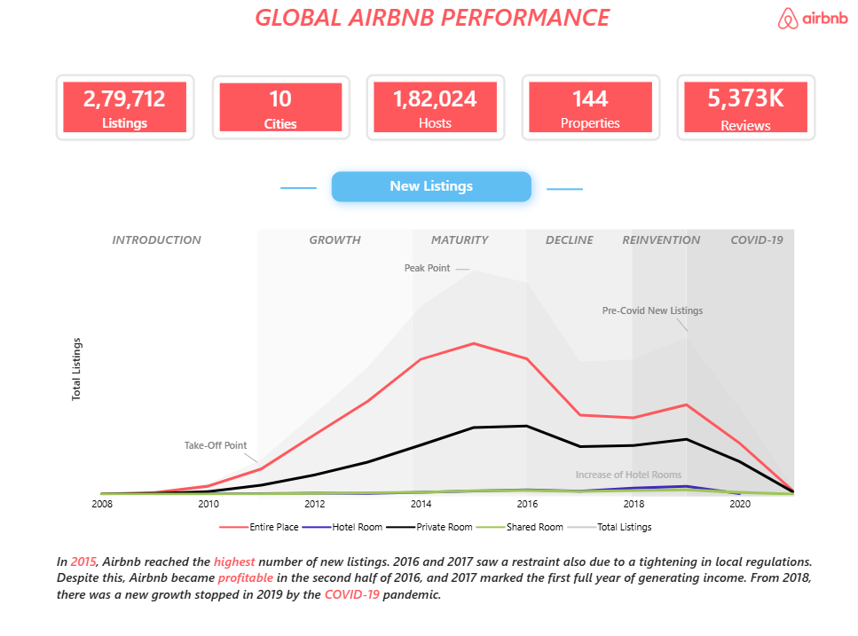

# 🏠 Airbnb Global Performance Analysis


---

## 01. 📌 Project Overview

The **Airbnb Global Performance Analysis** project is an interactive Power BI solution designed to evaluate marketplace performance across **279K+ listings, 182K+ hosts, 144 property types, 10 cities, and 5.3M+ reviews**.

The project combines data preparation, relational modeling, calculated columns, DAX measures, ranking, cumulative analysis, segmentation, and interactive visualization to investigate listing performance, guest ratings, host trust, and review behaviour.

**Workflow:**

**Raw Data → Data Preparation → Data Modeling → DAX → Dashboard → Insights → Recommendations**

---

## 02. 🎯 Business Problem

Airbnb operates across multiple markets with different listing characteristics, host profiles, guest experiences, and review behaviours.

This analysis is designed to answer:

- Which cities contribute the largest share of listings?
- How has listing activity changed over time?
- Which cities perform best and worst on guest ratings?
- Which rating dimensions are comparatively weaker?
- How prevalent is host verification?
- How frequently do customers contribute reviews?
- How concentrated is reviewer activity?
- How does review activity change seasonally?

---

## 03. 📂 Dataset

The project uses the **Airbnb Listings & Reviews** dataset from the Maven Analytics Data Playground.

**Dataset Provider:** Maven Analytics  
**Original Source:** Inside Airbnb  
**License:** Public Domain

### Dataset Highlights

| Metric | Value |
|---|---:|
| Listings | 279,712 |
| Hosts | 182,024 |
| Cities | 10 |
| Property Types | 144 |
| Reviews | 5.373M+ |

🔗 **[View Original Dataset →](https://mavenanalytics.io/data-playground/airbnb-listings-reviews)**

> The original source files are hosted externally because of their large size.

---

## 04. 🧹 Data Preparation

The source data was prepared for analysis by:

- Reviewing and organizing listing and review fields
- Managing data types
- Creating date-related analytical fields
- Creating reviewer-frequency fields
- Preparing host segmentation fields
- Structuring data for interactive dashboard analysis

---

## 05. 🧩 Data Model

The Power BI model connects **Listings** and **Reviews** through `listing_id`.

This relationship enables listing-level attributes such as city, property type, host characteristics, and pricing to be analyzed alongside review-level activity.


---

## 06. 🧮 Calculated Columns

The project includes calculated columns for specialized analysis:

- `Reviews per Reviewer`
- `Show in Review Frequency Chart`
- `Review Month`
- `Month Number`

These fields support the review-frequency and seasonality analyses.


---

## 07. 📐 DAX & Analytical Development

The project uses DAX for dynamic KPIs, ranking, segmentation, cumulative calculations, and review analysis.

### Key Measure Areas

**KPIs**
- Total Listings
- Total Hosts
- Total Reviews
- Average Price
- Average Rating

**City Analysis**
- City Rank
- Cumulative Listings
- Cumulative %
- Market contribution

**Host Analysis**
- Superhost Listings
- Non-Superhost Listings
- Verified Hosts
- Non-verified Hosts
- Profile-picture segmentation

**Review Analysis**
- Total Reviewers
- Reviews per Reviewer
- Cumulative Reviewers
- Cumulative % Reviews Frequency
- Monthly review analysis

---

## 08. 🔢 Advanced Cumulative Analysis

A cumulative reviewer measure was developed using `DISTINCTCOUNT`, `FILTER`, and `ALL()` to evaluate how reviewer activity accumulates across review-frequency thresholds.

```DAX
Cumulative Reviewers =
VAR CurrentReviews =
    MAX(Reviews[Reviews per Reviewer])
RETURN
    CALCULATE(
        DISTINCTCOUNT(Reviews[reviewer_id]),
        FILTER(
            ALL(Reviews[Reviews per Reviewer]),
            Reviews[Reviews per Reviewer] <= CurrentReviews
        )
    )
```

The resulting cumulative percentage shows:

- **86.5%** of reviewers contributed only one review.
- **98.8%** contributed three or fewer reviews.
- The cumulative distribution reaches **100%** as the remaining higher-frequency reviewers are included.

---

## 09. 🌎 Cumulative City Analysis

City ranking was combined with cumulative listing calculations to evaluate how quickly the highest-ranked cities account for the total listing base.

```DAX
Cumulative Listings =
VAR CurrentRank =
    MAXX(VALUES(Listings[city]), [City Rank])
RETURN
    CALCULATE(
        [Total Listings],
        FILTER(
            ALL(Listings[city]),
            [City Rank] <= CurrentRank
        )
    )
```

This creates a Pareto-style view of city market concentration.

---

## 10. 👤 Host Trust Analysis

Host trust was examined through combinations of identity verification and profile-picture availability.

Example:

```DAX
NotVerified_Profile =
CALCULATE(
    [Total Hosts],
    Listings[host_identity_verified] = "f",
    Listings[host_has_profile_pic] = "t"
)
```

This allows host profiles to be segmented into different verification and trust categories.

---

## 15. 🧩 Challenges & Solutions

### Challenge 1 — Different Data Granularities

The **Listings** and **Reviews** datasets contain information at different levels of detail.

**Solution:** Built a relational model around `listing_id` and used DAX filter-context logic to support listing-level and reviewer-level analysis without losing analytical flexibility.

### Challenge 2 — Measuring Reviewer Concentration

A simple review count does not show how reviewer participation is distributed.

**Solution:** Created `Reviews per Reviewer`, cumulative reviewer measures, and cumulative percentage calculations to build a Pareto-style view of reviewer behaviour.

### Challenge 3 — Combining Marketplace and Experience Metrics

Listing volume, host characteristics, ratings, and review behaviour represent different aspects of Airbnb's marketplace.

**Solution:** Organized the dashboard into Overview, Ratings, and Reviews sections so that marketplace performance, guest experience, and customer engagement can be analyzed together while remaining easy to navigate.

---

## 16. 📊 Interactive Dashboard

The screenshots below provide a preview of the completed report.

For the complete interactive Power BI file:

🔗 **[Open / Download Power BI Dashboard →](dashboard.md)**

## 17. 📊 Dashboard

### 🏠 Overview

The Overview page summarizes:

- Listings
- Cities
- Hosts
- Properties
- Reviews
- Listing growth
- Property/room-type trends
- City market share
- Average pricing



### ⭐ Ratings

The Ratings page analyzes:

- Overall city ratings
- Accuracy
- Cleanliness
- Communication
- Location
- Check-in
- Value for money


### 💬 Reviews

The Reviews page analyzes:

- Review frequency
- Cumulative reviewer behaviour
- Monthly review seasonality
- Host verification
- Profile-picture presence


---

## 12. 📌 Key KPIs

| Metric | Value |
|---|---:|
| Listings | 279,712 |
| Cities | 10 |
| Hosts | 182,024 |
| Properties | 144 |
| Reviews | 5.373M+ |

---

## 13. 💡 Key Insights

### 1. Marketplace Concentration

Paris, New York, and Sydney account for a substantial share of the analyzed listing ecosystem.

**Business implication:** Airbnb's overall marketplace performance is influenced heavily by a relatively small group of major urban markets.

**Potential action:** Prioritize host acquisition, quality initiatives, and market-specific growth strategies in high-contribution cities while identifying opportunities to strengthen lower-share markets.

---

### 2. Rating Performance Differs Across Cities

**Mexico City and Rio de Janeiro** show stronger overall rating performance, while **Hong Kong and Istanbul** rank comparatively lower.

The analysis also shows **cleanliness and value for money** as comparatively weaker rating dimensions.

**Business implication:** Overall guest satisfaction can vary meaningfully by market and by the specific experience dimension being evaluated.

**Potential action:** Use city-level rating scorecards to identify underperforming markets and focus host education or quality-improvement initiatives on the weakest dimensions.

---

### 3. Reviewer Activity Is Highly Concentrated

**86.5% of reviewers contributed only one review**, while **98.8% contributed three or fewer reviews**.

**Business implication:** The reviewer base is dominated by occasional contributors, creating a potential opportunity to increase repeat engagement.

**Potential action:** Test personalized post-stay reminders, repeat-review engagement campaigns, or loyalty mechanisms aimed at first-time reviewers.

---

### 4. Review Activity Is Seasonal

**Paris and Rome** show stronger review activity during the European summer period, while **New York** shows increased activity toward November and December.

**Business implication:** Customer engagement varies by market and season, which can affect when campaigns and host communication are most relevant.

**Potential action:** Use seasonal demand and review patterns to time market-specific campaigns, host communications, and customer-engagement initiatives.

---

### 5. Host Verification Is Widespread

More than two-thirds of hosts are fully verified, while the dashboard also evaluates profile-picture presence as an additional trust signal.

**Business implication:** Verification and profile completeness can contribute to how host trust is represented across the marketplace.

**Potential action:** Incorporate verification and profile completeness into host-quality initiatives and guest-facing trust communication.

---

## 14. 💼 Business Recommendations

### 1. Increase Repeat Reviewer Engagement

The strong concentration of one-time reviewers suggests an opportunity to improve repeat customer engagement.

**Recommended action:** Segment first-time reviewers and test targeted post-stay reminders, personalized review prompts, or loyalty-oriented engagement initiatives.

### 2. Prioritize Weak Rating Dimensions

Cleanliness and value for money appear comparatively weaker across the analyzed markets.

**Recommended action:** Build city-level experience scorecards and target host education or quality-improvement programs around the weakest dimensions.

### 3. Use Market Seasonality for Planning

Review activity differs across cities and months.

**Recommended action:** Align city-level marketing, host communication, and customer-engagement activity with periods of stronger observed review activity.

### 4. Use Trust Signals in Host Quality Programs

Verification and profile completeness provide measurable host-level trust indicators.

**Recommended action:** Encourage stronger host profile completeness and verification to support guest confidence and marketplace quality.

> These recommendations are analytical implications of the dashboard findings rather than measured business outcomes.

---

## 15. 🧠 Skills Demonstrated

| Area | Skills |
|---|---|
| Data Preparation | Cleaning, transformation, analytical field creation |
| Data Modeling | Relationships, filter context, relational modeling |
| DAX | `CALCULATE`, `FILTER`, `ALL`, `DISTINCTCOUNT`, `MAXX` |
| Advanced Analytics | Ranking, cumulative analysis, Pareto analysis |
| Customer Analytics | Review frequency, seasonality |
| Host Analytics | Verification and trust segmentation |
| Visualization | KPI cards, combo charts, interactive dashboard design |
| Business Analysis | Market analysis, findings, recommendations |

---

## 19. 📂 Project Files

### 📊 Power BI Dashboard

🔗 **[Download / Open Power BI Dashboard →](https://drive.google.com/file/d/1HuSs8TTBmUzy8C6Tp2DG09vaYdrCmwxH/view?usp=drive_link)**

### 📁 Project Datasets

🔗 **[Access Project Datasets →](https://drive.google.com/drive/folders/1KIa9Hq4CCvPmAxcjQuYo3S4b0doIILWY?usp=drive_link)**

> The `.pbix` file requires **Power BI Desktop** to open.

---

## 20. 📁 Project Structure

```text
Airbnb-Global-Performance/
│
├── README.md
├── Dashboard/
├── dataset/
├── images/
│   ├── overview.png
│   ├── ratings.png
│   ├── reviews.png
│   ├── data_model.png
│   └── dax_analysis.png
└── dashboard.md
```

---

## 21. 🎓 Key Takeaway

This project demonstrates the full Power BI analytics workflow:

**Data → Preparation → Modeling → DAX → Analysis → Visualization → Business Insights → Recommendations**

It demonstrates how structured data modeling and DAX can be used to move from descriptive reporting toward deeper marketplace, customer, and host analysis.

---

## 22. 👨‍💻 Author

**Adithya Ruby**

Computer Science Graduate | Data Analytics

Interested in **Data Analytics, Business Intelligence, SQL, Power BI, and Business Analysis**.
