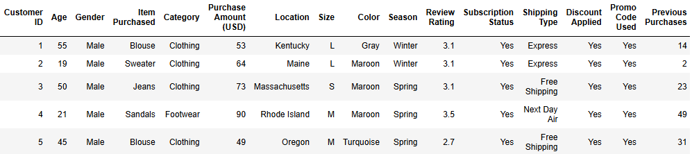
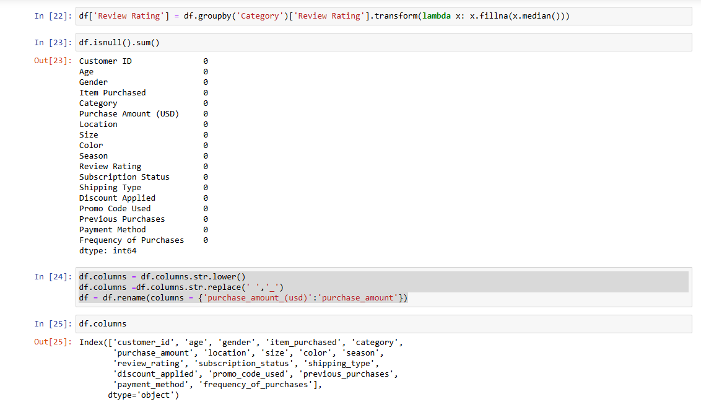
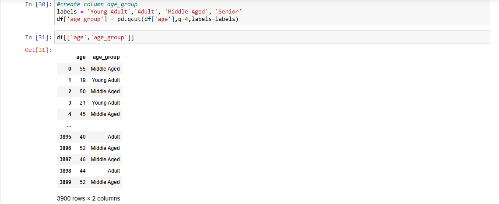
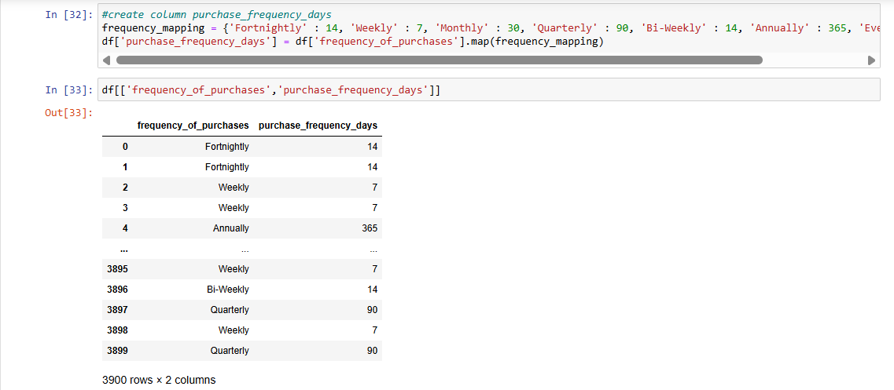
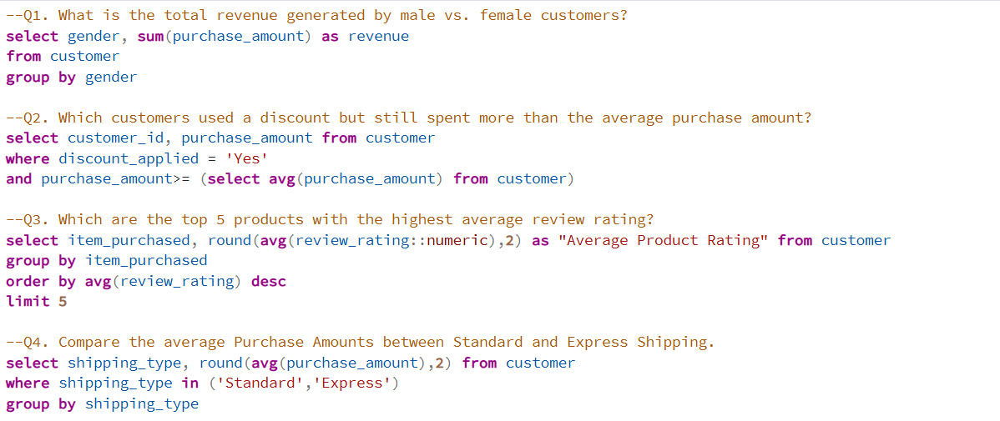
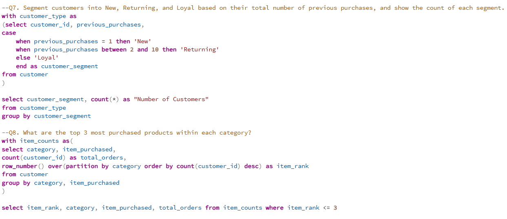
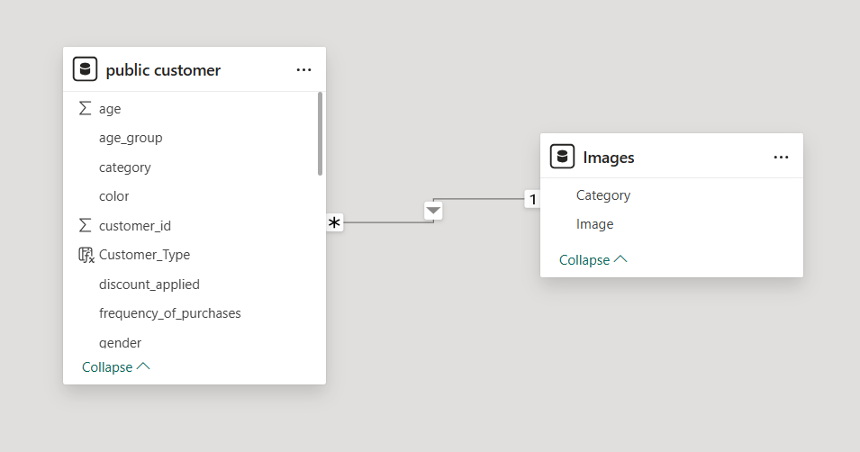
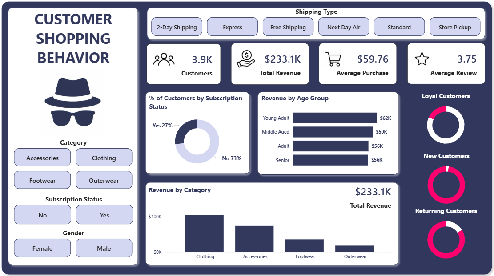

# 🛍️ Customer Shopping Behaviour Analysis


## Overview

This project analyzes customer shopping behaviour to understand purchasing patterns, customer segments, product preferences, and factors that influence consumer decisions.

The project follows an end-to-end data analytics workflow:

**Raw Data → Python EDA & Cleaning → Feature Engineering → PostgreSQL/SQL Analysis → Power BI Dashboard → Business Insights**

The analysis is designed around a retail business problem: using customer shopping data to identify trends, improve customer engagement and loyalty, and support better marketing and product strategies.

---

## 🎯 Business Problem

The business wants to better understand how customers behave across demographics, products, discounts, reviews, seasons, payment methods, and purchasing frequency.

The key business question is:

> **How can the company leverage consumer shopping data to identify trends, improve customer engagement, and optimize marketing and product strategies?**

---

## 🔄 Project Workflow

```text
                 Raw Customer Data
                        │
                        ▼
              Python + Pandas
              ┌─────────────────┐
              │ EDA             │
              │ Data Cleaning   │
              │ Transformation  │
              └────────┬────────┘
                       │
                       ▼
               Feature Engineering
                       │
                       ▼
                PostgreSQL + SQL
               Business Analysis
                       │
                       ▼
                  Power BI
             Dashboard + DAX
                       │
                       ▼
             Business Insights
              & Recommendations
```

---

# 📂 Dataset

The dataset contains **3,900 customer records** covering customer demographics, purchasing activity, product details, discounts, ratings, subscriptions, shipping preferences, payment methods, and purchase frequency.

### Main Columns

| Column | Description |
|---|---|
| `customer_id` | Unique customer identifier |
| `age` | Customer age |
| `gender` | Customer gender |
| `item_purchased` | Product purchased |
| `category` | Product category |
| `purchase_amount` | Purchase amount in USD |
| `location` | Customer location |
| `size` | Product size |
| `color` | Product colour |
| `season` | Season of purchase |
| `review_rating` | Customer review rating |
| `subscription_status` | Subscription status |
| `shipping_type` | Shipping method |
| `discount_applied` | Whether a discount was applied |
| `previous_purchases` | Number of previous purchases |
| `payment_method` | Payment method |
| `frequency_of_purchases` | Purchase frequency |

## Dataset Preview



---

# 🐍 Python – Data Preparation & EDA

Python and Pandas were used to inspect, clean, transform, and explore the raw dataset.

### Key Activities

- Loaded the CSV dataset using Pandas
- Inspected structure, data types, and descriptive statistics
- Checked for missing values
- Explored customer and purchasing patterns
- Standardized column names
- Removed redundant fields
- Created additional analytical features
- Prepared the cleaned dataset for SQL analysis

## Data Cleaning

The data cleaning process included:

- Handling missing `review_rating` values using the median rating within each product category
- Standardizing column names for easier analysis and SQL usage
- Removing the redundant `promo_code_used` column after checking its overlap with `discount_applied`
- Verifying that the cleaned dataset contained no remaining missing values



---

## Feature Engineering

### Age Group

Customers were segmented into four age groups:

- Young Adult
- Adult
- Middle Aged
- Senior



### Purchase Frequency in Days

Purchase frequency categories were converted into numerical day intervals to make frequency-based analysis easier.



---

# 🗄️ SQL Analysis

The cleaned dataset was loaded into a PostgreSQL database for structured business analysis.

SQL queries were used to answer practical business questions, including:

- What is the total revenue generated by male vs. female customers?
- Which discounted customers still spent above the average purchase amount?
- Which products have the highest average review ratings?
- How do average purchase amounts differ between shipping types?

### SQL Concepts Used

- `SELECT`
- `WHERE`
- `GROUP BY`
- Aggregate functions such as `SUM()` and `AVG()`
- Subqueries
- `ORDER BY`
- `LIMIT`
- `CASE WHEN`
- CTEs using `WITH`
- Window functions such as `ROW_NUMBER()`
- `PARTITION BY`
- Conditional filtering





---

# 🔗 Data Model

The Power BI model connects the customer data with a separate **Images** table using the **Category** field.

This relationship allows product/category visuals in the dashboard to be associated with the corresponding image data.



---

# 📊 Power BI Dashboard

The cleaned and analyzed data was visualized in Power BI through an interactive customer shopping behaviour dashboard.

### Dashboard Includes

- Total customers
- Total revenue
- Average purchase amount
- Average review rating
- Revenue by age group
- Revenue by category
- Subscription status
- Customer type
- Category filters
- Gender filters
- Shipping type filters

## Dashboard Preview



---

# 📌 Dashboard Snapshot

The dashboard provides a high-level view of the dataset, including:

| Metric | Value |
|---|---:|
| Customers | 3.9K |
| Total Revenue | $233.1K |
| Average Purchase | $59.76 |
| Average Review | 3.75 |
| Subscribers | 27% |

The dashboard also shows revenue comparisons across age groups and product categories, along with customer, subscription, gender, category, and shipping filters.

---

## 💡 Key Insights

### 1. Clothing Generates the Highest Revenue

Clothing contributes around **$100K**, making it the top-performing category.

**Why?** Higher customer demand for clothing drives its stronger revenue contribution.

---

### 2. Most Customers Are Non-Subscribers

Around **73% of customers are not subscribed**, while only 27% are subscribers.

**Why?** This shows a large opportunity to convert existing customers into subscribers through better offers and benefits.

---

### 3. Young Adults Generate the Most Revenue

Young Adults contribute approximately **$62K**, the highest among all age groups.

**Why?** Their purchasing activity contributes more revenue compared with the other age groups.

---

### 4. Discounts Can Encourage Higher Spending

SQL analysis found customers who used discounts but still spent **above the average purchase amount**.

**Why?** Well-targeted discounts can encourage customers to make higher-value purchases.

---

### 5. Customer Loyalty Can Be Segmented

Customers were classified as **New, Returning, and Loyal** based on their previous purchases.

**Why?** This helps the business target each customer group with more relevant offers and engagement strategies.

---

### 6. Product Ratings Show Customer Preferences

The SQL analysis identified the **top-rated products** based on customer reviews.

**Why?** Highly rated products can help identify products that customers value and respond positively to.

---

# 📝 Report

A project report was created to document the analysis, findings, and business recommendations derived from the Python, SQL, and Power BI stages.

> **Report:** `report/Customer_Shopping_Behaviour_Report.pdf`

---

# 📁 Project Structure

```text
Customer-Shopping-Behaviour-Analysis/
│
├── data/
│   └── customer_shopping_behavior.csv
│
├── python/
│   └── customer_shopping_behavior.ipynb
│
├── sql/
│   └── customer_behavior_queries.sql
│
├── powerbi/
│   └── Customer_Shopping_Behaviour.pbix
│
├── report/
│   └── Customer_Shopping_Behaviour_Report.pdf
│
├── images/
│   ├── data_model.png
│   ├── dataset_preview.png
│   ├── data_cleaning.png
│   ├── age_group_feature.png
│   ├── purchase_frequency_feature.png
│   ├── sql_analysis.png
│   └── powerbi_dashboard.png
│
└── README.md
```

---

# ⚙️ How to Run

## 1. Clone the Repository

```bash
git clone https://github.com/yourusername/customer-shopping-behaviour-analysis.git
cd customer-shopping-behaviour-analysis
```

## 2. Install Python Dependencies

```bash
pip install pandas sqlalchemy psycopg2-binary jupyter
```

## 3. Run the Python Notebook

```bash
jupyter notebook
```

Open the notebook in the `python` folder and run the cells to reproduce the data preparation, EDA, cleaning, and feature engineering steps.

## 4. Run the SQL Analysis

Set up a PostgreSQL database and load the cleaned dataset into the required table.

Then execute the SQL queries in the `sql` folder.

## 5. Open the Power BI Dashboard

Open the `.pbix` file using **Power BI Desktop**.

Update the database/data-source connection if required and refresh the model.

---

# 🧰 Tools & Technologies

| Tool | Purpose |
|---|---|
| **Python** | Data preparation and analysis |
| **Pandas** | Data manipulation and cleaning |
| **PostgreSQL** | Database and SQL analysis |
| **SQL** | Business-oriented data analysis |
| **Power BI** | Dashboard and visualization |
| **DAX** | Power BI calculations and measures |
| **Jupyter Notebook** | Python analysis environment |

---

# 🎓 Skills Demonstrated

**Data Cleaning • Exploratory Data Analysis • Feature Engineering • SQL • PostgreSQL • Python • Pandas • Power BI • DAX • Data Visualization • Business Analysis**

---

# 👨‍💻 Author

**Adithya Ruby**

Aspiring Data Analyst focused on transforming data into actionable business insights.

---

## ⭐ Project Summary

**An end-to-end customer analytics project demonstrating the complete journey from raw data to business insights using Python, SQL, and Power BI.**
