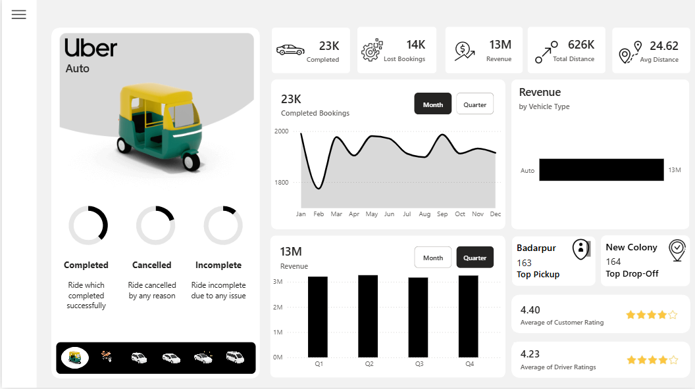

# 🚕 Uber Trip Analysis


---

## 01. 📌 Project Overview

The **Uber Trip Analysis** project is an interactive Power BI analytics solution built using **150,000 Uber trip records**.

The dashboard evaluates booking performance, revenue, vehicle performance, ride distance, cancellations, locations, and customer/driver ratings.

The project follows an end-to-end BI workflow:

**Raw Data → Data Preparation → Data Modeling → DAX → Dashboard → Insights → Business Recommendations**

The objective is to turn operational trip data into decision-oriented insights around **booking conversion, revenue generation, vehicle performance, customer experience, and operational efficiency**.

---

## 02. 🎯 Business Problem

Uber's operational performance depends on successfully converting booking demand into completed trips while maintaining revenue, service quality, and an efficient driver/vehicle supply.

This analysis is designed to answer:

- How many bookings are completed versus lost?
- Which vehicle types contribute the most revenue?
- How does revenue perform across time?
- Which pickup and drop-off locations have the highest activity?
- How significant are customer and driver cancellations?
- What is the typical ride distance?
- How do customer and driver ratings compare?
- Where are the largest opportunities for operational improvement?

---

## 03. 📂 Dataset

The dataset contains **150,000 Uber trip records and 19 attributes** covering booking, customer, vehicle, location, cancellation, revenue, distance, payment, and rating information.

### Main Data Areas

| Area | Examples |
|---|---|
| Booking | Booking ID, date, time, booking status |
| Customer | Customer ID, customer-related attributes |
| Vehicle | Vehicle type |
| Location | Pickup and drop-off locations |
| Revenue | Booking value |
| Trip | Ride distance |
| Cancellations | Customer and driver cancellation information |
| Experience | Customer and driver ratings |
| Payment | Payment method |

---

## 04. 🧹 Data Preparation

Power Query was used to prepare the raw Excel data for analysis.

### Key Activities

- Loaded the source dataset into Power BI
- Reviewed and organized source fields
- Prepared date and time fields for analysis
- Created a dedicated Calendar table
- Prepared supporting vehicle-image data
- Organized DAX measures in a dedicated `_Measures` table
- Structured the model for interactive dashboard analysis

The preparation stage created an analysis-ready foundation for KPI, trend, vehicle, location, and booking-status analysis.

---

## 05. 🧩 Data Model

The model uses supporting tables alongside the main Uber trip table.

### Main Components

- **UBER** — main trip, booking, revenue, distance, cancellation, and rating data
- **Calendar** — date, month, and quarter analysis
- **IMG** — supporting vehicle-type image data
- **_Measures** — organized DAX calculations

This structure separates the core fact data from supporting dimensions and measure logic, improving the organization of the Power BI model.

### Data Model Preview


---

## 06. 🧮 DAX & Analytical Development

DAX measures were developed to create dynamic KPIs and operational analysis.

### Key Measures

- Booking Count
- Completed Bookings
- Lost Bookings
- Average Distance
- Total Revenue
- Booking Status calculations
- Time-based calculations

A dedicated `_Measures` table was used to keep analytical calculations organized and easier to maintain.

---

## 07. 📊 Power BI Dashboard

The dashboard brings together operational, financial, vehicle, location, and customer-experience analysis.

### Dashboard Includes

- Completed bookings
- Lost bookings
- Total revenue
- Total distance
- Average distance
- Revenue by vehicle type
- Monthly booking trends
- Quarterly revenue
- Top pickup location
- Top drop-off location
- Customer ratings
- Driver ratings
- Booking-status analysis
- Vehicle-type selection

### Dashboard Preview



---

## 08. 📌 Dashboard Snapshot

| Metric | Value |
|---|---:|
| Completed Bookings | 93K |
| Lost Bookings | 57K |
| Revenue | $52M |
| Total Distance | 3M |
| Average Distance | 24.64 |
| Average Customer Rating | 4.40 |
| Average Driver Rating | 4.23 |

---

## 09. 🔍 Key Findings & Business Implications

### 1. Booking Loss Represents a Significant Opportunity

**Finding:** The dashboard shows approximately **93K completed bookings compared with 57K lost bookings**.

**Business implication:** A substantial share of booking opportunities does not convert into completed trips, indicating a meaningful operational improvement opportunity.

**Recommended analysis:** Segment lost bookings by cancellation type, vehicle type, location, and time period to identify the highest-impact drivers of booking loss.

---

### 2. Auto Is the Highest-Revenue Vehicle Type

**Finding:** **Auto generated approximately $13M**, making it the highest-revenue vehicle type in the dashboard.

**Business implication:** Auto is currently an important contributor to total revenue and may represent a significant vehicle segment for demand and supply planning.

**Recommended analysis:** Compare Auto's revenue contribution against booking volume, ride distance, cancellations, and geographic concentration to understand what is driving its stronger performance.

---

### 3. Quarterly Revenue Is Relatively Stable

**Finding:** Quarterly revenue remains relatively consistent at approximately **$13M per quarter**.

**Business implication:** Revenue generation has a relatively stable quarterly baseline rather than depending heavily on a single quarter.

**Recommended analysis:** Use the quarterly baseline to investigate whether changes in bookings, average booking value, vehicle mix, or cancellations explain the variation between periods.

---

### 4. Customer Ratings Are Higher Than Driver Ratings

**Finding:** The average customer rating is **4.40**, compared with an average driver rating of **4.23**.

**Business implication:** The rating gap warrants further investigation to determine whether specific vehicle types, locations, or periods are contributing disproportionately to the difference.

**Recommended analysis:** Segment customer and driver ratings by vehicle type, location, and time period to identify where the gap is largest.

---

### 5. Average Trip Distance Provides an Operational Benchmark

**Finding:** Average ride distance is approximately **24.64**.

**Business implication:** This provides a baseline for understanding typical trip characteristics and comparing distance patterns across vehicle types or locations.

**Recommended analysis:** Segment trip distance by vehicle type, booking status, and location to identify meaningful differences in trip structure.

---

### 6. Location Activity Highlights Demand Concentration

**Finding:** The dashboard identifies the most active pickup and drop-off locations.

**Business implication:** Ride activity is not distributed evenly across locations, which can create opportunities to improve supply allocation.

**Recommended analysis:** Compare top locations across time periods, cancellations, revenue, and vehicle demand to identify the highest-value operational zones.

---

## 10. 💼 Business Recommendations

### 1. Reduce Booking Losses

**Finding:** Approximately **57K bookings are lost versus 93K completed bookings**.

**Recommended action:** Prioritize the locations, vehicle types, and periods with the highest lost-booking rates and investigate the underlying cancellation patterns.

**Expected business value:** Reducing avoidable booking losses could improve booking conversion and operational efficiency.

---

### 2. Optimize High-Performing Vehicle Supply

**Finding:** Auto contributes approximately **$13M** in revenue.

**Recommended action:** Evaluate demand concentration, driver availability, cancellation patterns, and average booking value for Auto before making vehicle-supply decisions.

**Expected business value:** Better alignment between vehicle availability and demand could help protect revenue from a high-contributing segment.

---

### 3. Use Demand Hotspots for Supply Planning

**Finding:** The dashboard identifies high-activity pickup and drop-off locations.

**Recommended action:** Prioritize driver allocation and operational monitoring around the highest-demand locations, particularly during periods of elevated booking activity.

**Expected business value:** More responsive supply allocation could help reduce missed booking opportunities in demand-heavy areas.

---

### 4. Investigate the Customer–Driver Rating Gap

**Finding:** Customer rating averages **4.40**, while driver rating averages **4.23**.

**Recommended action:** Break down the rating gap by vehicle type, location, and time period before designing targeted driver-experience interventions.

**Expected business value:** Identifying the source of the rating gap can support more focused service-quality improvements.

---

### 5. Use Quarterly Performance as a Planning Baseline

**Finding:** Quarterly revenue is relatively stable at around **$13M**.

**Recommended action:** Use the stable quarterly baseline to identify operational deviations driven by cancellations, booking volume, average booking value, or vehicle mix.

**Expected business value:** This provides a consistent benchmark for monitoring future operational performance.

> These recommendations are analytical implications of the dashboard findings rather than measured business outcomes.

---

## 11. 🧩 Challenges & Solutions

### Challenge 1 — Turning Trip Data Into a Multi-Dimensional Operational View

The dataset contains booking, vehicle, revenue, location, cancellation, distance, and rating attributes that need to be analyzed together.

**Solution:** Built a structured Power BI model with supporting Calendar, vehicle-image, and measures tables to separate operational data from analytical logic.

---

### Challenge 2 — Supporting Time-Based Analysis

Booking and revenue performance needed to be evaluated by month and quarter.

**Solution:** Created a dedicated Calendar table and DAX measures to support consistent time-based analysis.

---

### Challenge 3 — Converting Operational Metrics Into Business Decisions

KPIs such as lost bookings, revenue, ratings, and distance provide observations but do not automatically explain what the business should do.

**Solution:** Connected major findings to business implications and recommended follow-up analysis around cancellations, demand hotspots, vehicle performance, and customer/driver experience.

---

## 12. 🧠 Skills Demonstrated

| Area | Skills |
|---|---|
| Data Preparation | Power Query, Excel data preparation, field organization |
| Data Modeling | Calendar table, supporting tables, relationships |
| DAX | KPI measures, booking metrics, time-based calculations |
| Operational Analytics | Booking, revenue, vehicle, location analysis |
| Customer Analytics | Customer and driver ratings |
| Time-Series Analysis | Monthly and quarterly trends |
| Visualization | KPI cards, comparisons, trends, interactive filters |
| Business Analysis | Findings, implications, recommendations |

---

## 13. 🛠️ Tools & Technologies

- **Power BI**
- **DAX**
- **Power Query**
- **Microsoft Excel**
- **Data Modeling**
- **Data Visualization**
- **Business Intelligence**

---

## 14. 📂 Project Files

The repository contains the project data, Power BI report, dashboard assets, and documentation.

```text
Uber-Trip-Analysis/
│
├── data/
│   └── uber.xlsx
│
├── Power BI/
│   └── Uber Dashboard.pbix
│
├── images/
│   ├── uber_dataset.png
│   ├── uber_data_model.png
│   ├── uber_home.png
│   └── uber_dashboard.png
│
└── README.md
```

---

## 15. ⚙️ How to Explore

1. Open the Power BI report using **Power BI Desktop**.
2. Update the Excel data-source path if required.
3. Refresh the dataset.
4. Use the dashboard filters to explore booking, vehicle, location, revenue, and customer/driver performance.

---

## 16. 🎓 Key Takeaway

This project demonstrates how **Power Query, data modeling, DAX, and Power BI** can be combined to transform operational trip data into an interactive decision-support dashboard.

The analysis moves from basic KPIs toward **booking-loss analysis, vehicle performance, demand concentration, time-based performance, and customer/driver experience**, with findings translated into potential operational actions.

---

## 👨‍💻 Author

**Adithya Ruby**

Computer Science Graduate | Data Analytics

Interested in **Data Analytics, Business Intelligence, SQL, Power BI, and Business Analysis**.
